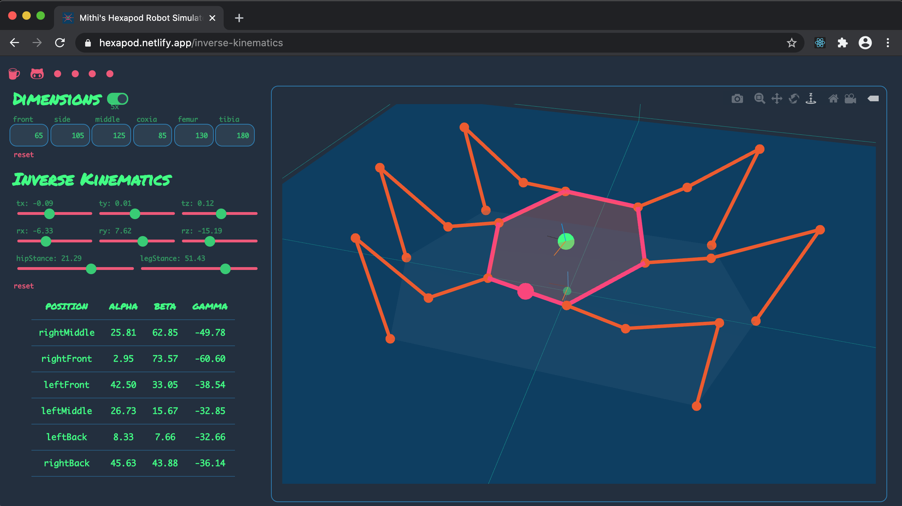
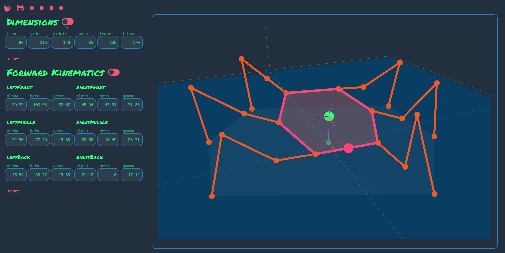
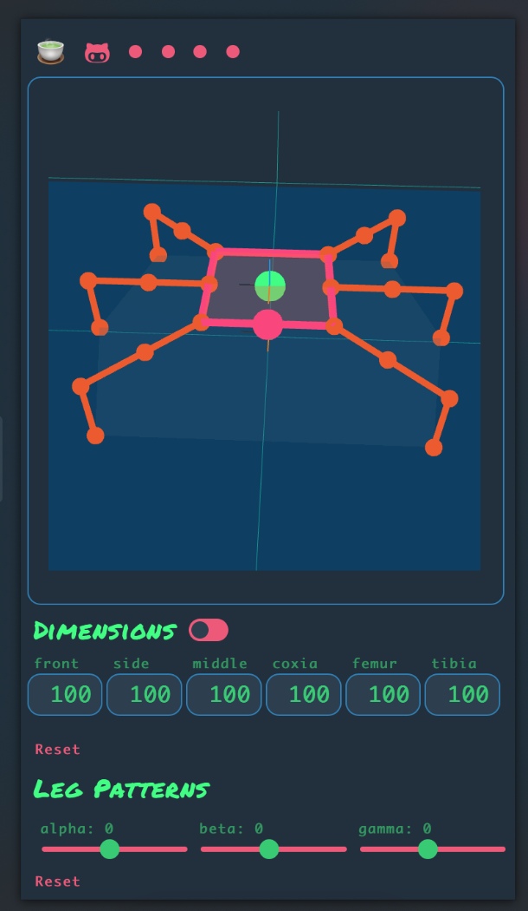

 

# Mithi's Bare-Minimum Hexapod Robot Simulator 2

You can use this web app to solve inverse kinematics, simulate various gaits and so much more. 

In real time, and at each step of the way, you can view all the angles the robot's eighteen joints make. 

Consider buying me [a few cups of coffee ☕ ☕ ☕](https://ko-fi.com/minimithi) to motivate me to build other robotics-related visualizers. (Quadrotors?!)

[🤖](https://hexapod.netlify.app/) [🐳](https://mithi.github.io/deep-blueberry/) [☕](https://ko-fi.com/minimithi)

## Features 

 

[🤖](https://hexapod.netlify.app/) [🐳](https://mithi.github.io/deep-blueberry/) [☕](https://ko-fi.com/minimithi)

Control
- [x] The robot's dimensions 
- [x] The robot's orientation and translation

Solve
- [x] Inverse Kinematics
- [x] Forward Kinematics

Simulate
- [x] Ripple and tripod gait variations
- [x] Walking forward and backwards
- [x] Rotating clockwise and counterclockwise

## Screenshots

|  |  | |  |
|------|-------|------|-------|

## Main Contributors
PRs welcome! Any contribution to improve the source code will be extremely appreciated. This is my first time coding in Javascript and this is also my first React app, so I'm sure there is a lot of room for improvement. [Contributing Guide](./CONTRIBUTING.md).

I will put your name below if I've merged your PR multiple times or if you've substantially contributed to this project in other ways.

- [@mithi](https://github.com/mithi)
- [@icyJoseph](https://github.com/icyJoseph)
- [@mikong](https://github.com/mikong)

## I love badges! (Don't we all?)  

