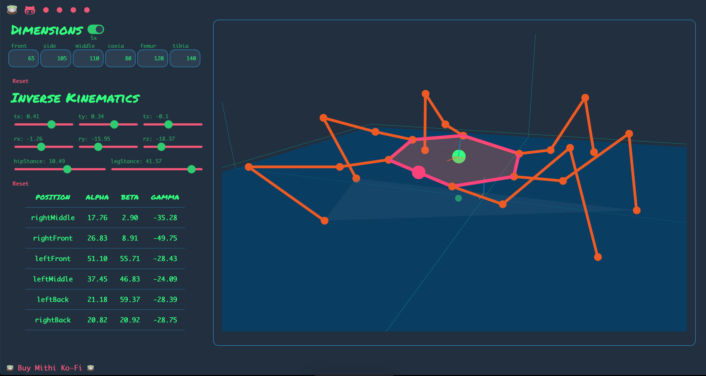
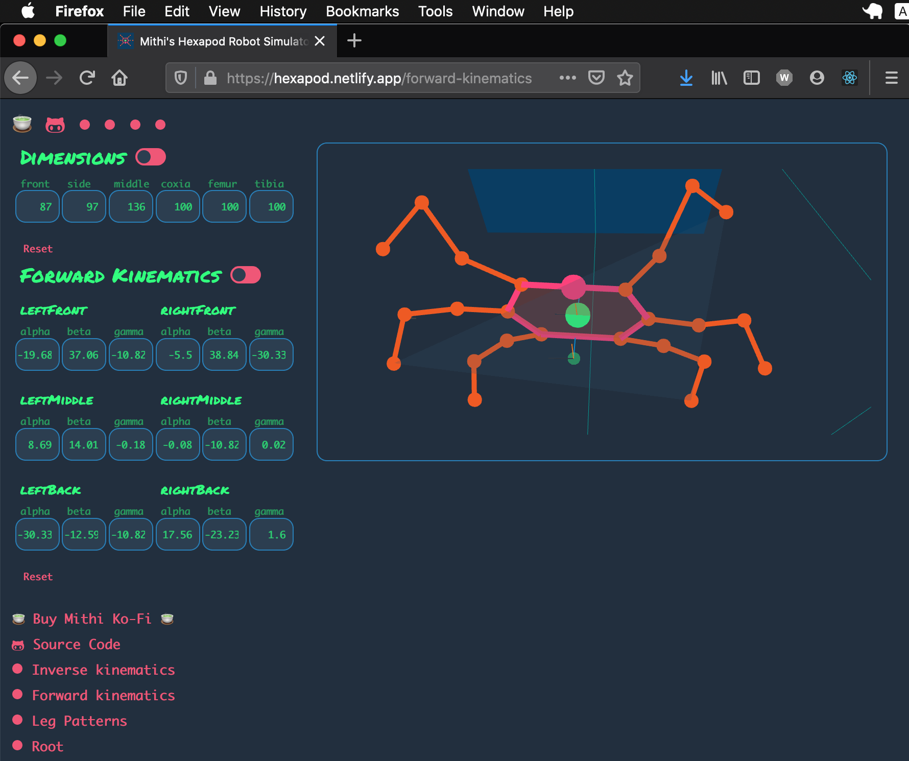
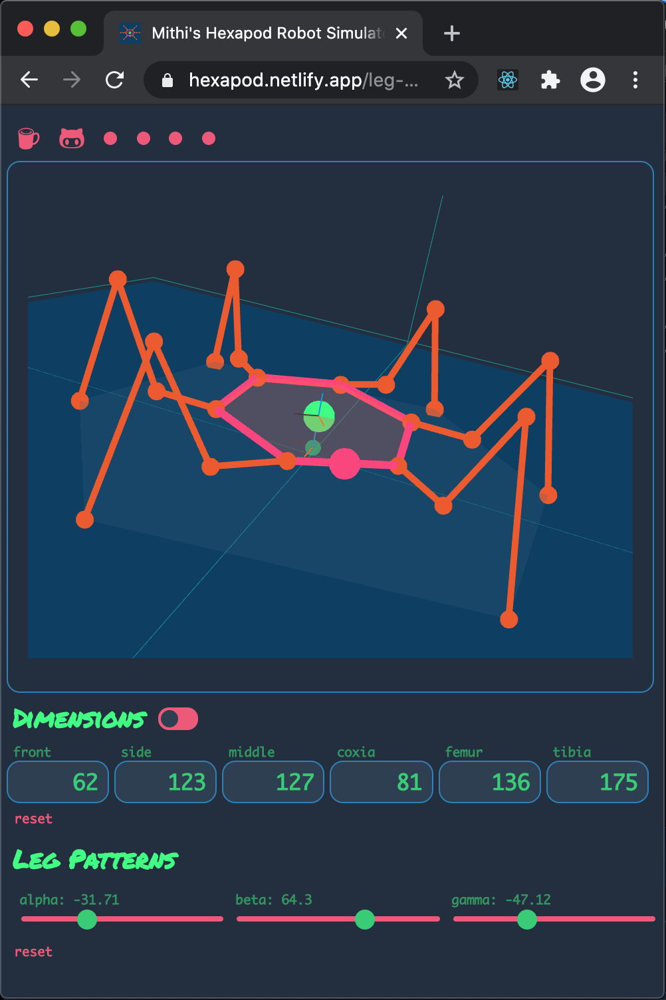

 

# Mithi's Bare-Minimum Hexapod Robot Simulator Rewrite
_(in Javascript!)_

- Solve (and visualize) forward and inverse kinematics purely on your browser! It's a complete rewrite of the [one I wrote in Python 🐍](https://github.com/mithi/hexapod-robot-simulator). Extremely fast! Zero server-side computations!
- Now live! [https://hexapod.netlify.app](https://hexapod.netlify.app)
- Consider buying me [a few cups of coffee ☕ ☕ ☕](https://ko-fi.com/minimithi) to motivate me to build other robotics-related visualizers. (Quadrotors?!)
## Contributions Welcome!    

- Any contribution to improve the source code will be extremely appreciated. 💙 Anything. Anything at all. This is my first time coding in Javascript and this is also my first React app, so I'm sure there is a lot of room for improvement.

|  |  |
|---|---|
| . | . |

## [☕](https://ko-fi.com/minimithi) I love badges! (Don't we all?)  

